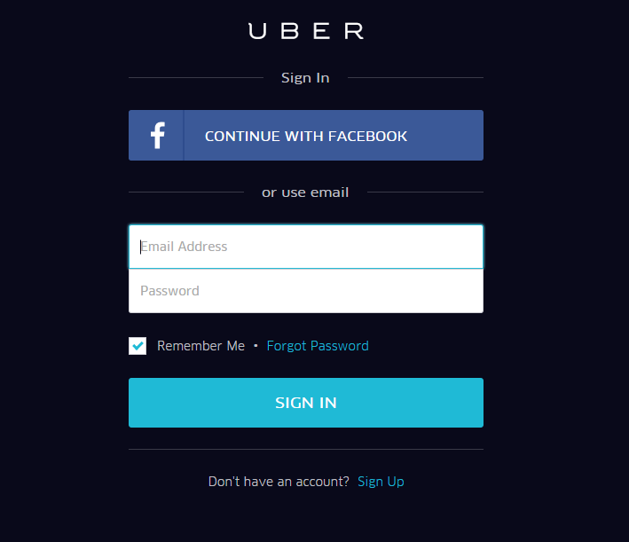
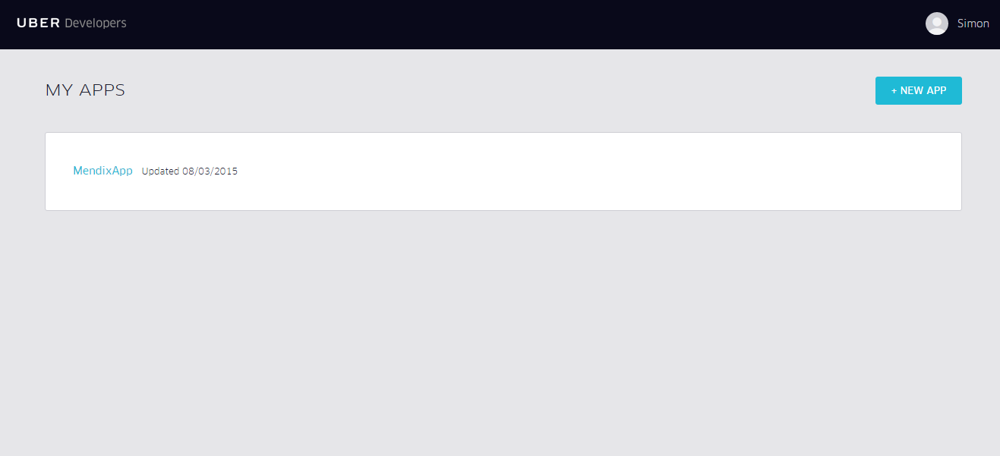
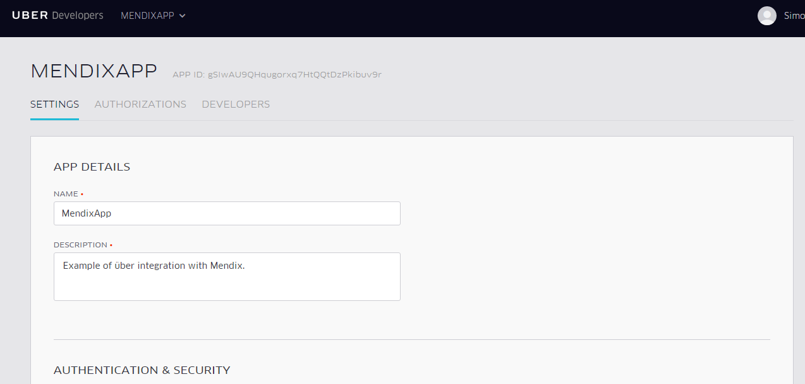
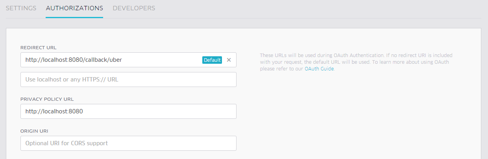

# UberMendixIntegration
This project is an example project to demonstrate how Mendix can be integrated to Uber. The project utilizes the REST and OAuth module from the appstores to show how users can login via Uber and search for prices, book taxis and see products.

## Setup
In order to use the application you will need an uber developers account. To register with uber developer simply go to: (https://developer.uber.com/)[https://developer.uber.com/] and click Manage Apps.

### Create New App Uber App
</img>

You will then need to sign up to Uber. Once logged in you will a screen like this:
</img>

Click NEW APP and you will be presented with a screen bellow:

</img>

You will need to add the redirect URL to the autorization of app:
</img>

If you want to use the application locally you should add a url like `http://localhost:8080/callback/uber`. Otherwise put the url of the your server.

### Setup your Mendix project
In order for the application to work you will need change 3 constants using the new app you have created on uber. Once you have set these up you can run the application.

#### ServerToken in UberIntegration Module
This constant should be filled with the Server Token, which can be found on your app in the uber platform under the tab settings.

#### ClientId_Uber in OauthModule Module
This constant should be filled with the client ID, which can be found on your app in the uber platform under the tab settings. 

#### ClientSecret_Uber in OauthModule
This constant should be filled with the client secret, which can be found on your app in the uber platform under the tab settings and pressing show.

#### Set up your project
Once you have set up the constants you will need to configure the OAuth module in the running application. 

1) Login with the MxAdmin username and password. Running locally this is usually set to MxAdmin and 1.
2) Click on Administration and MxReflection
3) Click on the module OauthModule and click Toggle module sync. Then click on Uber Integration and toggle module sync. Then click Synchronize objects.
4) Click on Administration menu and Get or Create Auth Config
5) In the Resolve user section select the microflow `OauthModule.ResolveUserByEmail`.
6) Then tick the Uber option and in the dialog box that appears enter `email`. Then click save.

You will now all be set up so that you can login via uber, search and book. 
